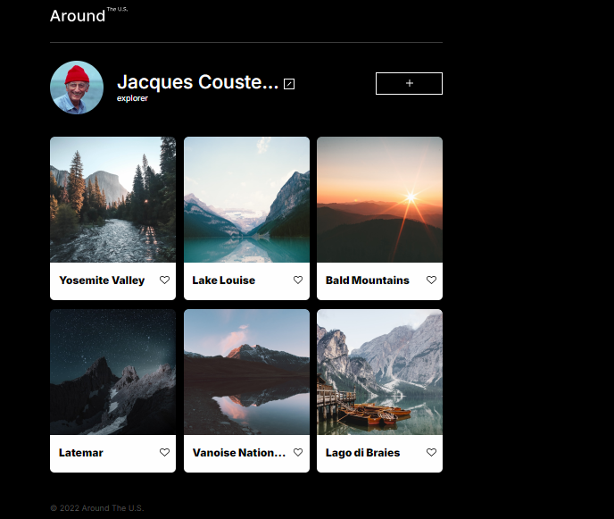

# Project 3: Around The U.S.

### Overview  

* Intro  
* Figma  
* Images  
  
**Intro**
  A stunning visual journey to six breathtaking destinations in the United States and Europe.

**Technologies**

- HTML5
- CSS3
- Figma (design)

**link to website**
https://pierrebrunel13.github.io/se_project_aroundtheus/

**video link**
https://www.loom.com/share/35fcef39aa94434294d51145f49a0abb?sid=c5c5ffa5-ed80-4567-97a1-b778d1343caa

**images**

